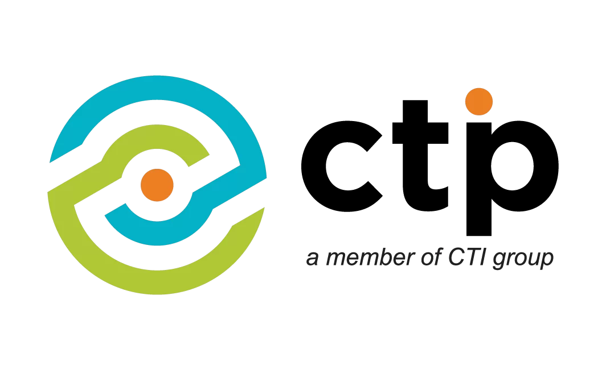

# **SimpleCRM**

_Customer Relation Management System_

## **Overview**

A lightweight yet powerful Customer Relationship Management (CRM) application designed to streamline customer interactions. Built as a simple CRUD (Create, Read, Update, Delete) system, it helps businesses efficiently manage client information, track interactions, and enhance customer engagement.

---

## **Tech Stack**

-   **Frontend**:
-   **Backend**:
-   **Database**: PostgreSQL
-   **Deployment**: AWS

---

## **Installation & Setup**

### Creating RDS via Easy Create (Estimated Provision Time: 5 Minutes)

    PostgreSQL
        - Free-Tier
        - DB-Instance Name = fil
        - Password = rootrootroot (subject to change)

### EC2 Provisioning Pre-requisites

-   PHP 8.3
-   Composer
-   Node.js

-   php artisan key:generate

#### Security Groups:

    - Application Load Balancer: ALLOW Inbound Traffic to TCP 80 anywhere IPv4
       - Link it to -> App Security Group: ALLOW Inbound Traffic from ALB SG (All Traffic)
            - Link it to -> RDS Security Group: ALLOW PostgreSQL 5432 from App Security Group

---

## **Contributors**

👤 **Jace**  
👤 **JC**  
👤 **Samantha**  
👤 **Francis**

---

## License

The Laravel framework is open-sourced software licensed under the [MIT license](https://opensource.org/licenses/MIT).
